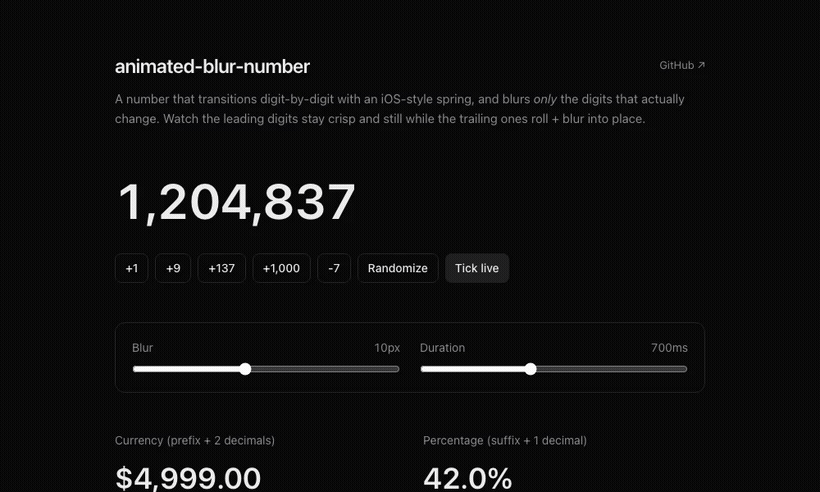

# animated-blur-number

A React number that transitions **digit-by-digit** with an iOS-style spring, and blurs **only the digits that actually change**. Unchanged digits stay crisp and perfectly still.

Inspired by iOS's `.contentTransition(.numericText())` and [motion.dev](https://motion.dev/docs/react-animate-number) - with the blur on top.



**Live demo:** <!-- LIVE_DEMO -->[animated-blur-number.vercel.app](https://animated-blur-number.vercel.app)<!-- /LIVE_DEMO -->

## Why it looks good

- **Per-digit, diffed.** `1,204,837 → 1,204,974` animates only the trailing `837 → 974`; the `1,204,` never moves.
- **iOS spring.** The slide rides a `linear()` easing baked from a damped spring (subtle ~5% overshoot + settle), not a flat ease.
- **Blur scoped to change.** Each changing digit blurs as it travels and sharpens as it lands - like motion blur, only where something moved.
- **Directional.** Rolls up on increase, down on decrease.
- **SSR-safe.** Formats with a fixed locale (default `en-US`) so server and client agree - no hydration drift.
- **Accessible.** The full value is exposed to screen readers; the animated slots are `aria-hidden`. Honors `prefers-reduced-motion` (instant swap, no blur).
- **Zero runtime dependencies.** Just React + one CSS file. Copy two files in.

## Install

This is a copy-in component (no package to install). Grab the two files:

- [`src/components/animate-number.tsx`](src/components/animate-number.tsx)
- [`src/components/animate-number.css`](src/components/animate-number.css)

Drop them into your project. The `.tsx` imports its own `.css`, so a bundler that handles CSS imports (Next.js, Vite, etc.) is all you need.

## Usage

```tsx
import { AnimateNumber } from "@/components/animate-number";

// plain integer (grouped)
<AnimateNumber value={count} />

// currency
<AnimateNumber
  value={price}
  prefix="$"
  format={{ minimumFractionDigits: 2, maximumFractionDigits: 2 }}
/>

// percentage, faster + blurrier
<AnimateNumber value={pct} suffix="%" duration={400} blur={12} />
```

## Props

| Prop        | Type                        | Default     | Description                                                        |
| ----------- | --------------------------- | ----------- | ------------------------------------------------------------------ |
| `value`     | `number`                    | -           | The number to display. Changing it animates the affected digits.   |
| `format`    | `Intl.NumberFormatOptions`  | `undefined` | Passed to `Intl.NumberFormat` (grouping, fraction digits, etc.).   |
| `locale`    | `string`                    | `"en-US"`   | Formatting locale. Keep it fixed to avoid SSR hydration mismatches.|
| `prefix`    | `React.ReactNode`           | `undefined` | Rendered before the number (e.g. `"$"`).                           |
| `suffix`    | `React.ReactNode`           | `undefined` | Rendered after the number (e.g. `"%"`).                            |
| `duration`  | `number` (ms)               | `600`       | Slide + blur duration.                                             |
| `blur`      | `number` (px)               | `8`         | Peak blur of a changing digit. `0` disables the blur.              |
| `className` | `string`                    | `undefined` | Applied to the root; also forwards any other `<span>` props.       |

> Tip: use a fixed-width font feature for the cleanest motion. The CSS already sets `font-variant-numeric: tabular-nums` on the root.

## How it works

The formatted value is split into characters and rendered **right-aligned**, one slot per place value (keyed by its offset from the right, so the ones digit / decimal point keep a stable identity as the number grows or shrinks). A slot only mounts its animating layers when its own character differs from the previous one.

Each changing slot stacks two layers - the incoming digit and the outgoing one - and runs **two animations** at once:

- a **spring** on `transform` (the vertical slide + overshoot), and
- an **ease** on `opacity` + `filter: blur()` (the fade and de-blur).

Splitting them keeps the spring's overshoot out of opacity/blur (where values above 1 / below 0 would clamp). The spring is a `linear()` easing precomputed from a damped harmonic oscillator (`zeta = 0.68`), so it's pure CSS - no JS animation loop.

## Demo app

This repo is also a tiny Next.js app showcasing the component. Run it locally:

```bash
npm install
npm run dev
# open http://localhost:3000
```

## Recording the GIF

The demo GIF is produced from the running demo with Playwright + ffmpeg:

```bash
npm i -D playwright && npx playwright install chromium
npm run dev                                   # in one terminal
DEMO_URL=http://localhost:3000 npm run record # in another
# then convert the webm:
ffmpeg -y -i recording/*.webm \
  -vf "fps=24,scale=820:-1:flags=lanczos,split[s0][s1];[s0]palettegen=max_colors=128[p];[s1][p]paletteuse=dither=bayer" \
  -loop 0 public/demo.gif
```

## License

[MIT](LICENSE) © [serafim](https://github.com/serafimcloud)
